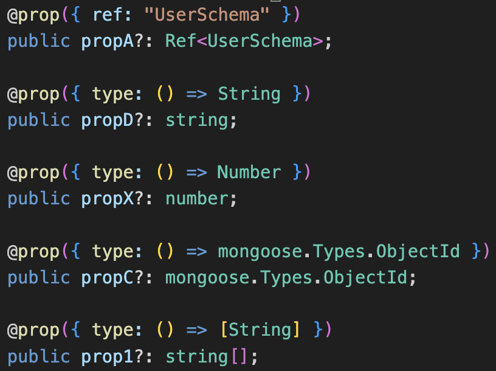
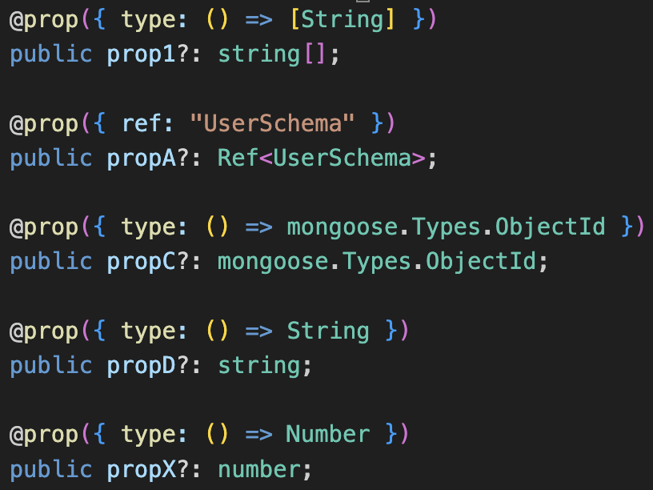

# Typegoose Sort README

## Overview

Typegoose Sort is a tool for sorting typegoose models by property name

## How to use

Highlight the properties you would like to sort

Type 'Typegoose Sort' into the command palette (Cmd + Shift + P)

## Caveats

Models must be single new-line separated

Models will be sorted using `.localeCompare()` (https://developer.mozilla.org/en-US/docs/Web/JavaScript/Reference/Global_Objects/String/localeCompare)

# Example:

Unsorted code:

Sorted code:

## Release Notes
